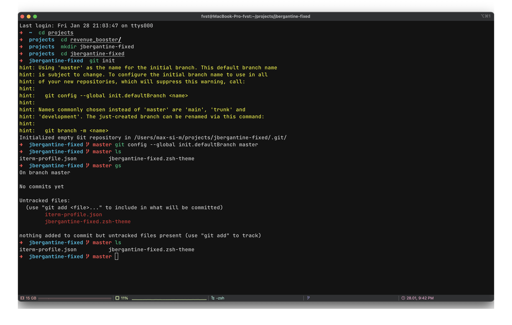

# Updated Jbergantine ITerm2 theme

Move theme file into `~/.oh-my-zsh/themes`.

Import iterm profile `iterm-profile.json` for colorschema and fonts setup.

~~~bash
ZSH_THEME="jbergantine-updated"

source $ZSH/oh-my-zsh.sh
source /opt/homebrew/share/zsh-syntax-highlighting/zsh-syntax-highlighting.zsh
~~~
